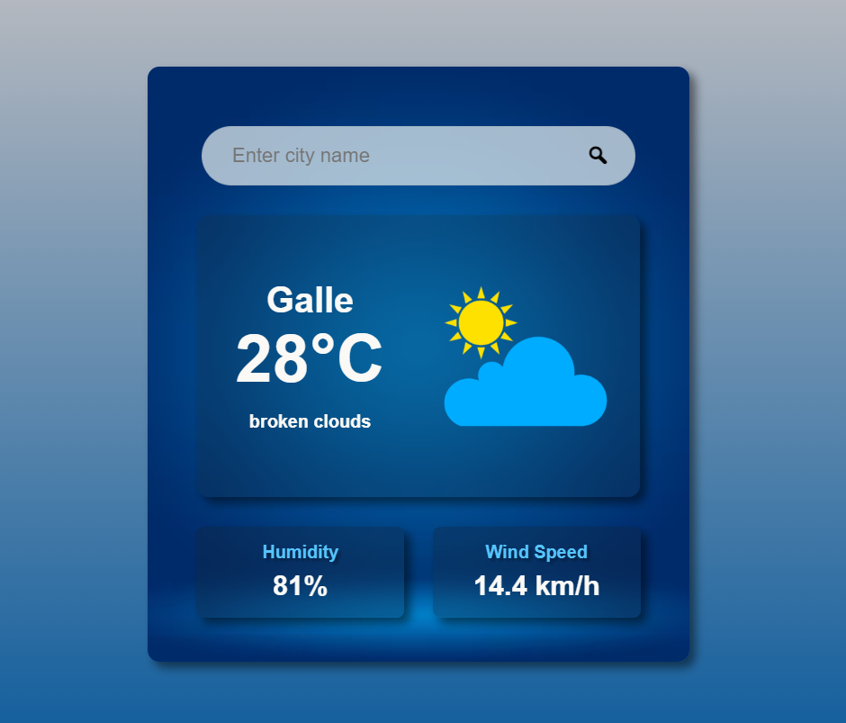

# 🌤️ Weather App (React + OpenWeather API)

A modern, responsive weather application built with React that fetches real-time weather data using the OpenWeather API. It displays temperature, humidity, wind speed, and weather conditions with a clean UI, loading state, and error handling.

---

## 📌 Description (350 chars)

A modern React Weather App that fetches real-time weather data using the OpenWeather API. It displays temperature, humidity, wind speed, and weather conditions with a clean UI, loading state, and error handling. Users can search any city worldwide and get instant live weather updates.

---

## 📸 Preview

---

## 🚀 Features

- 🔍 Search any city weather instantly  
- 🌡️ Real-time temperature in Celsius  
- 💧 Humidity percentage  
- 🌬️ Wind speed converted to km/h  
- 🌦️ Weather description (clouds, rain, etc.)  
- ⏳ Loading spinner overlay  
- ⚠️ Error handling for invalid cities  
- 🎨 Modern glassmorphism UI design  
- 📱 Responsive layout  

---

## 🛠️ Tech Stack

- React (useState, useEffect)  
- JavaScript (ES6+)  
- CSS3 (Glassmorphism + animations)  
- OpenWeather API  

---

## 🔑 API Setup

- Get your API key from:  
https://openweathermap.org/api  

- Add your API key in your project:

    const API_KEY = "your_api_key_here";

---

## ⚡ How It Works

- User enters a city name  
- App sends request to OpenWeather API  
- Weather data is fetched and stored in state  
- UI updates instantly with results  
- Loading overlay shown during fetch  
- Errors handled gracefully  

---

## 🎯 Future Improvements

- 🌍 Auto-detect user location  
- 🌈 Dynamic weather-based backgrounds  
- 📊 7-day forecast system  
- ⚡ Debounced search optimization  
- 📱 Better mobile-first UI  